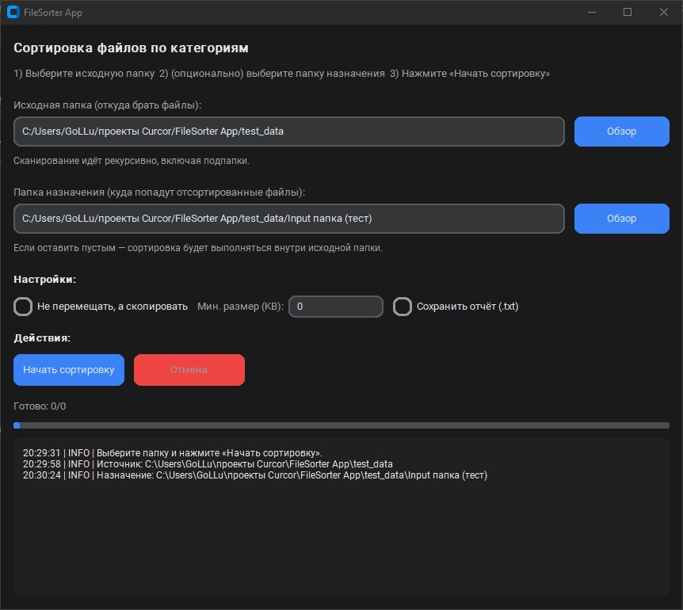
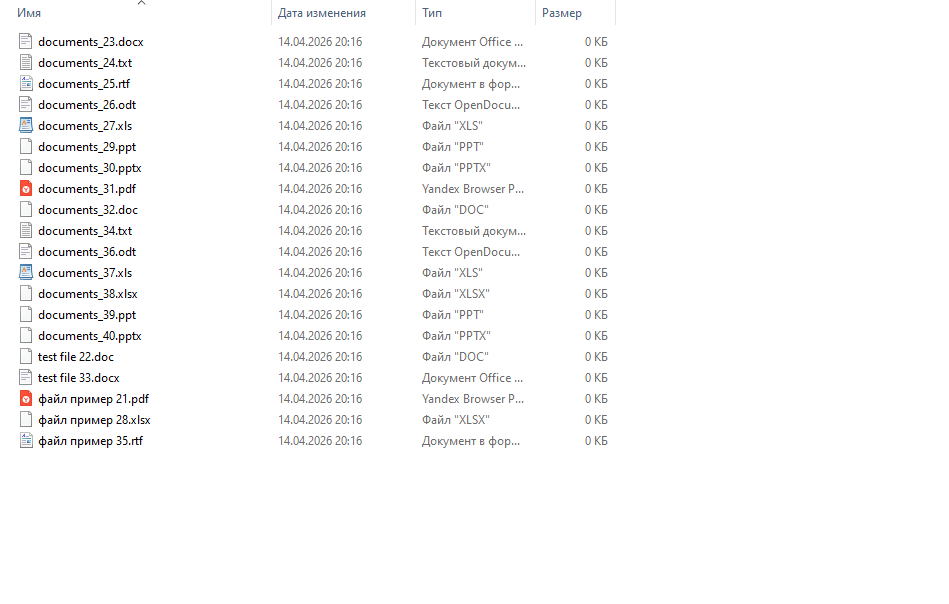
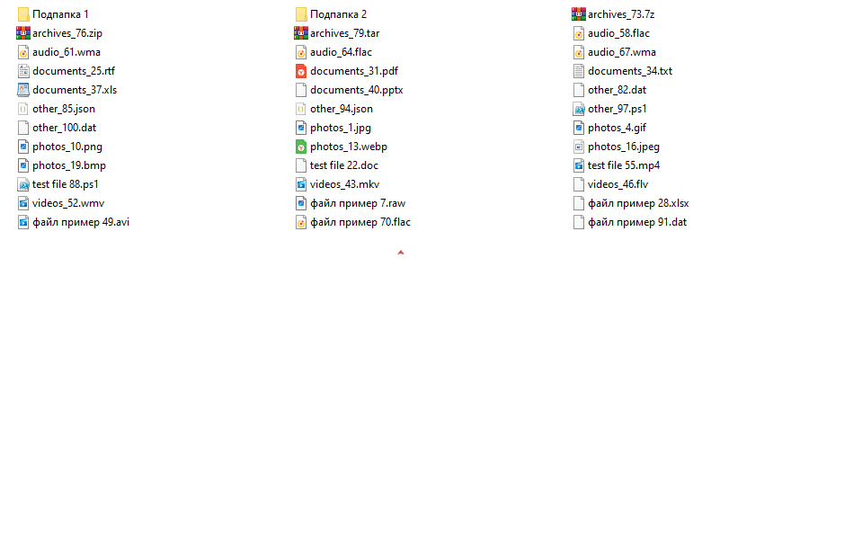

# 📂 FileSorter App

## Автоматический сортировщик файлов на Python с современным GUI

Приложение для наведения порядка в файловой системе. Сортирует тысячи файлов по папкам (Фото, Документы, Видео, Архивы) за секунды.

> 🛠 Разработано с использованием AI-подхода и архитектуры CustomTkinter.

## ✨ Ключевые особенности

- 🎨 **Современный UI:** Тёмная тема, плавные элементы (CustomTkinter).
- ⚡ **Высокая скорость:** Многопоточность (Threading) — интерфейс не зависает при обработке 10,000+ файлов.
- 🔄 **Гибкие настройки:** Режимы "Переместить" или "Скопировать".
- 📊 **Умная логика:**
  - Рекурсивное сканирование (учитывает подпапки).
  - Защита от перезаписи (авто-переименование при конфликте имен).
  - Игнорирование системных файлов.
- 📝 **Отчетность:** Детальный лог операций + выгрузка отчета в `.txt`.

## 📸 Демонстрация

### Главное окно


*Простое управление: выбор папки, запуск, мониторинг прогресса.*

### Результат работы


*Файлы автоматически распределены по категориям.*

### До и После


*Превращение хаоса в структуру за один клик.*

## 🚀 Установка и запуск

Вам потребуется **Python 3.11+**.

1. **Клонируйте репозиторий:**

   ```bash
git clone https://github.com/pycraft-dev/FileSorter-App.git
   cd FileSorterApp
   ```

2. Установите зависимости:

   ```bash
   pip install -r requirements.txt
   ```

3. Запустите приложение:

   ```bash
   python main.py
   ```

Проект создан с соблюдением лучших практик Python разработки:

- Модульность: Разделение логики (`/core`), интерфейса (`/ui`) и утилит (`/utils`).
- Type Hinting: Полная аннотация типов для надежности.
- Обработка ошибок: Безопасная работа с занятыми файлами и путями с кириллицей.

## Заказ разработки

Понравился результат? Я могу написать аналогичное приложение под ваши задачи.

# 👋 Привет! Я Вова (pycraft-dev)

Python-разработчик, создаю удобные десктопные приложения и инструменты автоматизации.

## 🔧 Технологии
- **GUI:** CustomTkinter, PyQt5, Tkinter
- **Backend:** Python 3.11+, asyncio, threading
- **Automation:** Pandas, OpenPyXL, BeautifulSoup

## 📬 Контакты
📧 [pycraft-dev@21051992.ru](mailto:pycraft-dev@21051992.ru)  
💼 [Kwork](https://kwork.ru/user/pycraft-dev)  
🐙 [GitHub](https://github.com/pycraft-dev)
